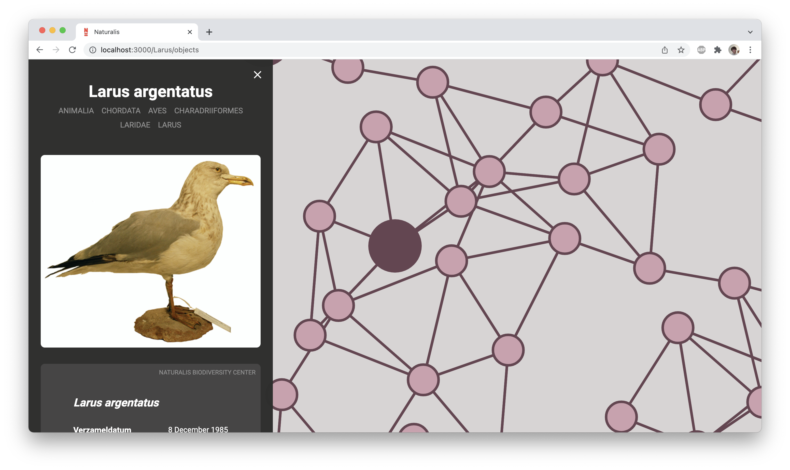
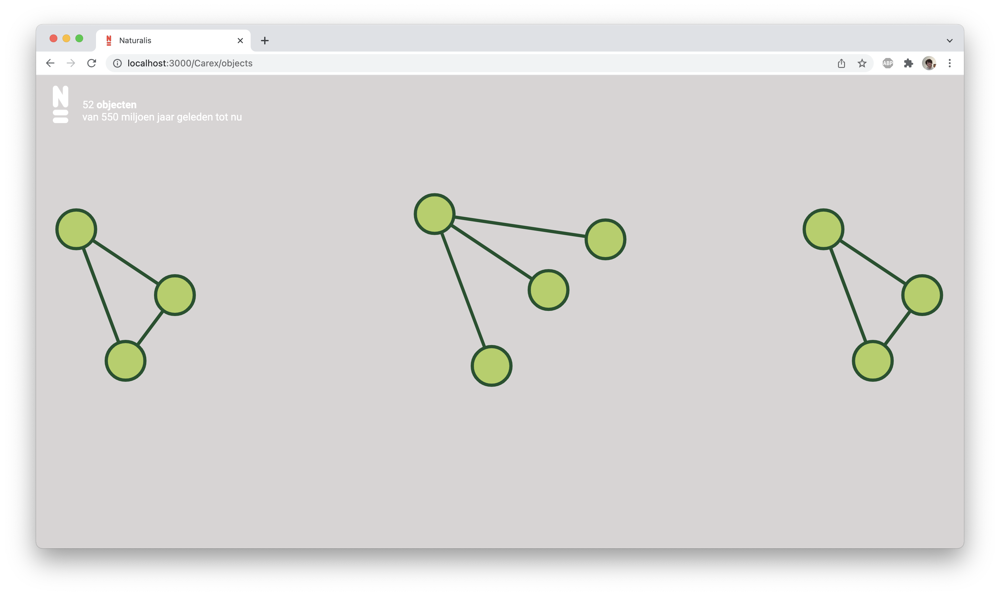

# Project Naturalis Q42

## 📋 The concept

Hi! Welcome to our repository for the website we made during the five week project at the end of our theme semester Information Design! Here you can find the website we produced during this project.

We were tasked by [Q42](https://www.q42.nl/)to create an interactive data visualization that could display GBIF data. Q42 had already created an interactive map on which a user could find objects from the collection of Naturalis or the Natuurhistorisch Museum Rotterdam. The problem was that many of the objects in these collections did not have any geolocation data which meant that they could not be displayed on the map. We were tasked with designing an alternative view to the map which could display all objects from the collections.

We eventually decided to create a multi layered bubble chart based on the taxonomic rank of the objects. With the help of our prototype a user can dive through the taxonomic ranks to find the objects of the collections.

Feel free to clone this repository locally or visit [this site]() and take a look!

> **NOTE:** The content on this website is partially written in Dutch!

## 🧑‍💻 How to install

> **NOTE:** Before you can install this project be sure to have both [Node.js](https://nodejs.org/en/download/) and NPM installed. NPM should automatically be installed when installing Node.js.

You can install our project locally by running the following command in your local folder.

-   `git clone https://github.com/Steinberg99/functional-programming`

When you have cloned our repository run the command `npm install` to install all of the project dependencies. Run this command in the local folder where you cloned our project. When you have done this you can run the command `npm start` to start the project. The website should open automatically in the browser on `localhost:3000`.

## 💻 Technologies

During this project we made use of the following technologies, libraries or API’s.

-   [Node.js](https://nodejs.org/en/download/),
-   [React](https://reactjs.org/),
-   [p5](https://p5js.org/reference/)
-   [GBIF API](https://www.gbif.org/developer/summary)

## ✍️ Authors and license

Authors: [Stein Bergervoet](https://github.com/Steinberg99/) & [Jort Broekhof](https://github.com/Jortdus)

